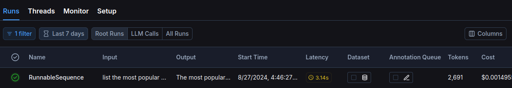

# LLM Tracing

The goal of this repo is to show progress of monitoring/observability approaches for LLM services in Python. I'll start with the simple logger.info() and then move to more advanced tools like OpenTelemetry and LLM-specific tracing libraries.

## Steps:

### 0.4.0 
The simples way to trace the LLM ap is to use LangSmith's tracing library and stream data to their servers.
The installation is simplem since we use LangChain:
```bash
export LANGCHAIN_API_KEY=lsv2_pt_sfdfgsdfsdf4s5d2f4sdfs5f4sd7_21s1df4sdfs_fake
export LANGCHAIN_TRACING_V2=true
export LANGCHAIN_PROJECT=llm-tracing
```


Generated SQL query is pretty complicated:
```sql
SELECT "Album"."Title", COUNT("InvoiceLine"."TrackId") AS "TotalTracksSold"
FROM "Album"
JOIN "Track" ON "Album"."AlbumId" = "Track"."AlbumId"
JOIN "InvoiceLine" ON "Track"."TrackId" = "InvoiceLine"."TrackId"
GROUP BY "Album"."AlbumId"
ORDER BY "TotalTracksSold" DESC
LIMIT 5;
```

And we know that out query cost around 0.00015 USD.


The LangSmith's service is pretty simple to use and it gives us a nice baseline for our tracing needs.

We can also get self hosted version of the service. https://docs.smith.langchain.com/self_hosting . And they claim that you can use any framework with their service(but they have seamless integration with LangChain).

Another camp are the open-source projects that are trying to solve the same problem:
1. https://github.com/traceloop/openllmetry
2. https://github.com/Arize-ai/phoenix

But they rely on the OpenTelemetry standard, making them plugins to our architecture. So, we can try to use one of them with our app and see how it goes. But at first let's do some OPSing and install observability tools locally and add some otel instrumentation to our app.

### 0.3.0 
Q&A LLM app with SQLite backend. 
It uses as an input human questions about data, translate them to SQL and generated the answer based on the retrieved data.
https://python.langchain.com/v0.1/docs/use_cases/sql/quickstart/

The app works fine. For example, given the following question:
```
list the most popular albums
```
We will get nicely formatted answer:
```
The most popular albums based on the total number of tracks sold are:
1. Minha Historia - 27 tracks sold
2. Greatest Hits - 26 tracks sold
3. Unplugged - 25 tracks sold
4. Acústico - 22 tracks sold
5. Greatest Kiss - 20 tracks sold
```
But what's happening under the hood? How can we trace the execution of the app?

### 0.2.0 
Simple FastAPI app that uses custom JSON logger and configured root-level logger.

### 0.1.0 
Simple FastAPI app that uses logging with Python's built-in logging module